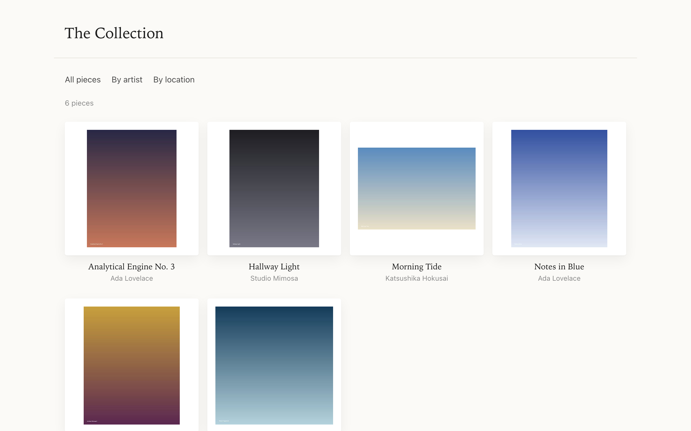
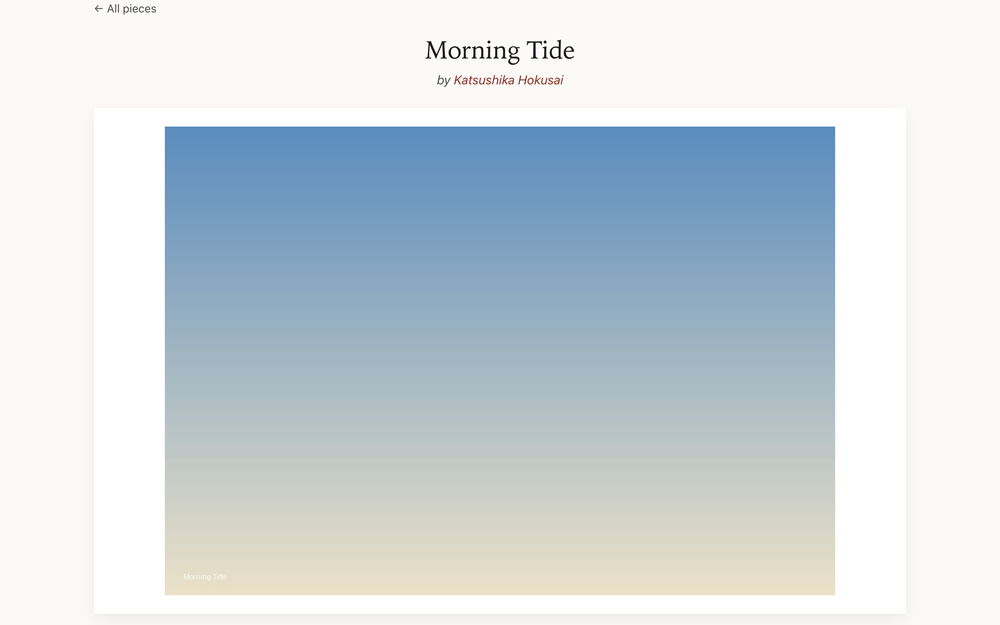
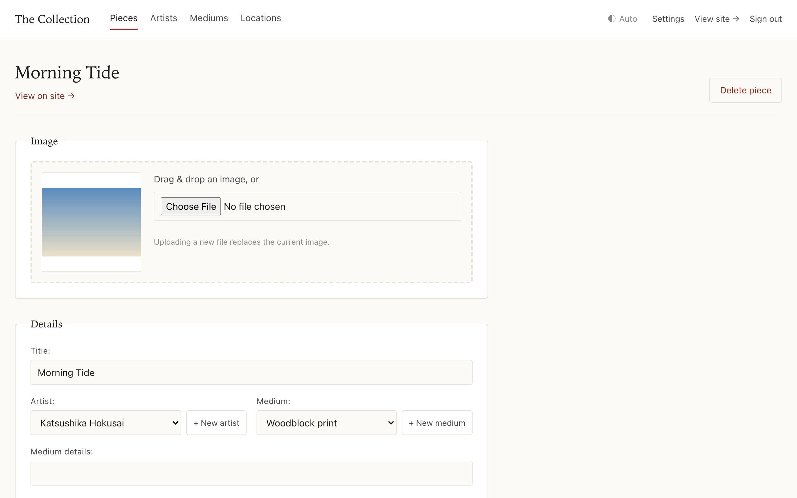

# Artsite

A small, self-hostable web app for cataloguing and showing off a personal art
collection — your pieces, the artists behind them, where each one lives, and how
you acquired them — behind a clean public gallery and a friendly curator admin.


It’s deliberately small and dependency-light: a single Django app, hand-rolled
CSS (no build step), a sprinkle of vanilla JS and [htmx](https://htmx.org/), and
pluggable media storage so you can run it on a cloud bucket **or** entirely on
your own hardware.

---

## Screenshots

| Gallery | Piece detail | Curator admin |
| :-----: | :----------: | :-----------: |
|  |  |  |

> _Captured from the bundled `seed_demo` sample data._

## Features

### A gallery worth showing off
- **Three ways to browse** — everything (most-recently-acquired first), grouped
  **by artist** (with portraits and bios), or grouped **by location**, each with
  a quick jump-to nav.
- **Considered detail pages** — full-resolution image with a **click-to-zoom
  lightbox**, the artwork’s metadata, and an _About the artist_ aside.
- **No layout shift** — image dimensions are captured on upload (and backfilled
  for older images on first view), so the page reserves each image’s box before
  it loads.
- **Light / Dark / Auto** — a discreet cycling theme toggle, persisted across
  visits, with no flash of the wrong theme on load (it follows your OS in Auto).
- **Fast and gentle** — thumbnails lazy-load and fade in, the hero image is
  prioritised, and motion respects `prefers-reduced-motion`.
- **Accessible by default** — the lightbox is a real focus-trapping dialog,
  keyboard-operable, with visible focus rings and `aria-live` status messages.
- **Good link previews** — Open Graph tags (with an absolute `og:image`) for
  tidy unfurls when you share a piece.

### A friendly curator admin (`/curate/`)
- **Staff-only**, separate from Django’s built-in admin (which is still there at
  `/admin/` if you want it).
- **Full CRUD** for pieces, artists, mediums, and locations, plus a singleton
  **site-settings** editor (site name, footer, default currency & units).
- **Drag-and-drop image upload** with an instant client-side preview.
- **Quick add** — catalogue a whole room from your phone: photograph the pieces
  with the normal camera app, upload the batch in one go, and each becomes a
  **draft** (placeholder artist/location, no title) that's **hidden from the
  public site** until you sit down and fill in the details. Prefer them to show
  up straight away? Turn off *“Quick add starts pieces as drafts”* in Settings.
  Either way, a piece's web address isn't fixed until it has a title and a real
  artist — so finishing one later never leaves a placeholder URL behind, and once
  fixed it never moves. Any piece can be drafted or published from its edit form.
- **Staff-only documents** — attach receipts, valuations, and condition reports
  to a piece, each with an image/PDF thumbnail. Stored in a separate private
  location and streamed only through a staff-gated view, so they’re **never**
  reachable from the public site.
- **Add an artist/medium/location without leaving the form** — htmx inline-create
  modals splice the new option straight into the dropdown.
- **Search & rich filtering** — full-text-ish search, filter by artist / medium /
  location / tagged state, plus tri-state **“presence” filters** (e.g. _has a
  price?_, _missing dimensions?_) behind a collapsible **More** panel. Applied
  filters produce clean, shareable URLs.
- **Safe deletes** — you can’t delete an artist/medium/location that still has
  pieces; the app tells you to reassign them first instead of cascading.

### NFC tagging for physical artwork
Stick an NFC tag behind a piece, write its URL to the tag from the admin, and a
phone tap opens that piece’s page. Staff can mark pieces tagged, and an
**Untagged** view tracks what’s left to do.

### Built for self-hosting
- **Pluggable storage** — one env var (`STORAGE_BACKEND`) switches media between
  **Google Cloud Storage** and the **local filesystem**, so the same codebase
  runs on a managed platform or on a box in your house with images on a NAS.
- **Privacy-respecting** — purchase price, currency, private notes, and
  uploaded documents are **never** rendered on (or reachable from) public pages;
  the whole site is blocked from search engines by default (`robots.txt`).
  Acquisition notes/date are public (toggle what you show by editing the detail
  template).
- **Two reference deployments** — Fly.io (`fly.toml.example`) and rootless **Podman**
  Quadlet with a Postgres sidecar (`deploy/`), plus a step-by-step migration
  runbook and a DB backup script. See **[`deploy/SELF_HOSTING.md`](deploy/SELF_HOSTING.md)**.
- **Well tested** — 430+ tests covering models, views, the curator admin, the
  storage commands, and access-control, runnable with no network or credentials,
  and run on every push and PR by GitHub Actions CI.

## Tech stack

Django 6 · PostgreSQL · [easy-thumbnails](https://github.com/SmileyChris/easy-thumbnails) ·
[django-htmx](https://github.com/adamchainz/django-htmx) ·
[WhiteNoise](https://whitenoise.readthedocs.io/) ·
[django-storages](https://django-storages.readthedocs.io/) ·
gunicorn (threaded workers) · [Ruff](https://docs.astral.sh/ruff/). Python 3.12.

## Quick start

Try it locally in a couple of minutes — SQLite + local image storage, no cloud
account needed.

With no configuration, it runs on the local filesystem for media and a throwaway
SQLite database, so there's nothing to set up:

```bash
git clone https://github.com/<you>/artsite.git
cd artsite

python -m venv .venv && source .venv/bin/activate
pip install -r requirements.txt

python manage.py migrate
python manage.py createsuperuser      # a staff user — needed to reach /curate/
python manage.py seed_demo            # optional: a few sample pieces to look at
python manage.py runserver
```

> **Install trouble?** The binary deps (`pillow-heif`, `pypdfium2`,
> `psycopg2-binary`) ship pre-built wheels for common platforms; if `pip` falls
> back to compiling them (an old pip or an unusual CPU architecture), run
> `pip install -U pip` first. The requirements include the Postgres and GCS
> clients even for this SQLite local run — that's expected, not a misconfiguration.

(Or just `./dev.sh`, which sets those local defaults, migrates, and runs the
server in one step.)

Now open:

- <http://127.0.0.1:8000/> — the public gallery (populated if you ran `seed_demo`;
  remove the samples any time with `python manage.py seed_demo --clear`)
- <http://127.0.0.1:8000/curate/> — sign in and start adding artists & pieces

> **Automating the first admin?** `createsuperuser` is interactive, but for a
> container/CI you can create one non-interactively:
> `DJANGO_SUPERUSER_PASSWORD=… python manage.py createsuperuser --noinput --username admin --email you@example.com`.

That’s it — uploaded images are stored under `./media/` and served by the dev
server. For production, point `DATABASE_URL` at PostgreSQL and pick a storage
backend (below).

## Configuration

All configuration is via environment variables.

| Variable | Required | Description |
| --- | --- | --- |
| `DATABASE_URL` | in production | Database URL ([dj-database-url](https://github.com/jazzband/dj-database-url) format). PostgreSQL in production; defaults to a throwaway SQLite file in development. |
| `STORAGE_BACKEND` | no (default `local`) | `local` (filesystem) or `gcs` (Google Cloud Storage). Drives both image and thumbnail storage. |
| `MEDIA_ROOT` / `MEDIA_URL` | no | Where local media lives / its URL prefix (`STORAGE_BACKEND=local`; default `<project>/media` and `/media/`; the container sets `/data/media`). |
| `PRIVATE_MEDIA_ROOT` | no | Where staff-only documents live, kept out of the public media tree (local backend; default `<project>/private`). |
| `STATIC_ROOT` | no | Where `collectstatic` writes (default `<project>/staticfiles`). |
| `GS_BUCKET_NAME` | only for `gcs` | GCS bucket holding media; **required** when `STORAGE_BACKEND=gcs`. |
| `GS_PROJECT_ID` | no | GCS project; inferred from the service-account key if unset. |
| `GOOGLE_APPLICATION_CREDENTIALS` | only for `gcs` | Path to a GCS service-account JSON key. |
| `ENVIRONMENT` | no (default `development`) | `production` enables HTTPS/HSTS/secure cookies and **requires** `DJANGO_SECRET_KEY` + `DATABASE_URL`. Unrecognised values fail closed. |
| `DJANGO_SECRET_KEY` | in production | Django secret key. Generate one with `python -c 'import secrets; print(secrets.token_urlsafe(50))'`. |
| `LANGUAGE_CODE` / `TIME_ZONE` | no | Locale (default `en-us` / `UTC`). The default **currency**, **units**, and **site name** are set in `/curate/` site settings, no restart needed. |

> For the `gcs` backend, set `GS_BUCKET_NAME` (and optionally `GS_PROJECT_ID`) in
> the environment — no source edits. The in-bucket path prefix defaults to `art`
> (prod) / `art-dev` (dev); override it with `GS_LOCATION`.

## Deployment

### Docker Compose (recommended)

The simplest way to run your own instance: app + PostgreSQL + Caddy, with
**automatic HTTPS** from just a domain name. On any host with Docker:

```bash
cp .env.example .env          # set DOMAIN, DJANGO_SECRET_KEY, the DB password
docker compose up -d --build
```

Point your domain's DNS at the host (with ports 80 and 443 open) and open
`https://<your-domain>/`. The stack migrates the database, optionally creates a
first admin and loads sample data (both controlled in `.env`), serves media from
a persistent volume, and Caddy provisions and renews the TLS certificate for you.
Media and the database live in named volumes, so they survive `down`/`up`; back
them up with `docker compose exec` + the usual `pg_dump`/file copy.

### Reference deployments

The app also ships two production deployments wired for a specific platform:

- **Fly.io** — copy `fly.toml.example` to `fly.toml` (gitignored) and fill in
  your app name, bucket, and hostnames (GCS storage; the service-account key is
  supplied as a Fly secret, not baked into the image).
- **Self-hosted Podman** — rootless Quadlet units in `deploy/` (app + Postgres
  sidecar, local media on a mounted volume served by Caddy).

**[`deploy/SELF_HOSTING.md`](deploy/SELF_HOSTING.md)** is the full guide: a
fresh install (walked through on a Debian box, running under a dedicated
unprivileged user), serving `/media/`, backups, and — as an appendix — migrating
an existing GCS/Fly deployment onto your own hardware.

### Backups & recovery

Two things hold your data: the **PostgreSQL database** and the **media** (uploaded
images *and* the staff-only documents, which have no other copy). Back up both.

- **Docker Compose** — they live in named volumes, so dump them out:

  ```bash
  docker compose exec -T db sh -c 'pg_dump -U "$POSTGRES_USER" "$POSTGRES_DB"' > db-backup.sql
  docker compose cp app:/data/media ./media-backup
  docker compose cp app:/data/private ./private-backup
  ```

- **Self-hosted Podman** — `deploy/` ships scheduled scripts: `backup-db.sh`
  (`pg_dump` to the NAS), `backup-media.sh` (rsync media + private off-box, keep an
  off-site copy), and `restore-drill.sh`, which restores the latest dump into a
  throwaway container and runs `verify_media` so you learn the backups are *usable
  together*, not just present. Wire them up with the `deploy/systemd/` timers.

- **Portable export** — a database-agnostic, human-readable copy of the
  collection's *records* (artists, pieces, locations, settings — not the image
  files), via Django's `dumpdata`. **Run it against your real database:** these
  commands read `DATABASE_URL`, and with it unset they fall back to the local
  SQLite file — so a bare `dumpdata` on a dev box dumps an *empty* DB (`[]`), not
  your Postgres. Run it inside the deployment, or set `DATABASE_URL` explicitly:

  ```bash
  docker compose exec app python manage.py dumpdata art --indent 2 --output collection.json
  podman exec artsite       python manage.py dumpdata art --indent 2 --output collection.json
  fly ssh console -C "python manage.py dumpdata art --indent 2" > collection.json
  DATABASE_URL=postgres://…   python manage.py dumpdata art --indent 2 --output collection.json
  ```

  Restore into a fresh, migrated database with `… manage.py loaddata
  collection.json` (same `DATABASE_URL` caveat), then copy your media files
  alongside. This is the easiest way to move a collection between databases or
  storage backends (SQLite ↔ Postgres, local ↔ GCS); the physical `pg_dump`/volume
  backups above are for routine disaster recovery.

- **Forgot the admin password?** `changepassword` works on any deployment — see
  [Account recovery](#account-recovery).

### Account recovery

The curate admin gates on a **staff** account, and there's no email-based password
reset — one less thing to run (no SMTP to configure) for what's usually a one- or
two-person site. Reset or create an admin from the shell instead, on whichever
deployment you run:

| Deployment | Reset a password |
| --- | --- |
| Local / dev | `python manage.py changepassword <username>` |
| Docker Compose | `docker compose exec app python manage.py changepassword <username>` |
| Fly.io | `fly ssh console`, then `python manage.py changepassword <username>` |
| Self-hosted Podman | `podman exec -it artsite python manage.py changepassword <username>` |

Locked out entirely? `createsuperuser` (same per-target prefix) makes a fresh
staff account. Locked out by repeated bad logins (django-axes)? Clear it with
`python manage.py axes_reset` — it also self-clears after 30 minutes, or just sign
in from a different network/IP.

## Upgrading

**Back up first** ([Backups & recovery](#backups--recovery)) — migrations are
often one-way. Then pull, reinstall, migrate, and restart:

```bash
git pull
pip install -r requirements.txt       # picks up dependency bumps
python manage.py migrate              # apply any new migrations
```

Restart for your deployment: `./dev.sh` (local) · `docker compose up -d --build`
· `systemctl --user restart artsite.service` (Podman) · `fly deploy` (Fly, which
runs `migrate` itself via `release_command`).

> artsite tracks **Django 6.0, which is not an LTS release**, so its mainstream
> support window is short. Keep moving along the 6.x line (or onto the next Django
> LTS) rather than pinning indefinitely; watch the
> [Django release process](https://docs.djangoproject.com/en/dev/internals/release-process/)
> for end-of-support dates.

## Development

```bash
# Run the test suite — SQLite + in-memory storage, no network or credentials
python manage.py test --settings=artsite.settings_test

# Coverage (dev deps: pip install -r requirements-dev.txt)
coverage run manage.py test --settings=artsite.settings_test && coverage report -m

# Lint & auto-format your changes
ruff check .
ruff format .
```

CI (GitHub Actions, `.github/workflows/ci.yml`) runs `ruff check`, `ruff format
--check`, and the full suite on every push and PR — all credential-free. To catch
the same issues locally on commit, install the matching pre-commit hook:

```bash
pip install pre-commit && pre-commit install
```

Tests live in `art/tests/` (one module per concern: models, public views, curator
views, forms, security, admin, misc) with shared builders in `tests/factories.py`.

### Storage maintenance commands

```bash
# List bucket/disk files no live record references; --delete removes them (dry-run by default)
python manage.py cleanup_orphan_images
python manage.py cleanup_orphan_images --delete

# Verify every image the database references actually exists in storage
# (the pre-cutover check when moving media between backends)
python manage.py verify_media
```

## Project layout

```
artsite/
├── art/                  # the single Django app
│   ├── models.py         # Piece, Artist, Medium, Location, SiteSettings (UUID PKs)
│   ├── views.py          # public gallery (ListView/DetailView)
│   ├── views_curate.py   # the /curate/ staff admin
│   ├── forms.py
│   ├── templates/        # art/ (public) and curate/ (admin)
│   ├── static/art/       # hand-rolled CSS + vanilla JS
│   ├── management/commands/   # cleanup_orphan_images, verify_media
│   └── tests/
├── artsite/              # project settings, URLs, WSGI
├── deploy/               # Podman Quadlet units, Caddyfile, backup script, SELF_HOSTING.md
├── Dockerfile  ·  fly.toml.example
└── manage.py
```

## Data & privacy

> **Your gallery is public.** Every piece, artist, and **full-resolution original
> image** you add is served to anyone who visits the site or knows (or guesses) an
> image URL — there is no per-piece "private" or login-gated mode for the gallery
> itself. The bundled `robots.txt` only asks search engines not to *index* the
> site; it does **not** restrict access. If you want a private collection, put the
> whole site behind authentication at your reverse proxy, a VPN, or a private
> network.

What artsite *does* keep private — never rendered on, or reachable from, a public
page (there are tests that enforce it) — is each piece's **purchase price**,
**currency**, **private notes**, and any attached **documents** (receipts,
valuations, condition reports). **Draft** pieces are held back too: they're
absent from every public list and their own page 404s for visitors (a signed-in
curator can still preview it), until you publish them. Acquisition free-text and date *are* shown
publicly. EXIF metadata (GPS, camera, timestamps) is stripped from every uploaded
image, since the originals are public.

## Contributing & getting help

Issues and pull requests are welcome — see [`CONTRIBUTING.md`](CONTRIBUTING.md)
for the dev setup and checks (short version: run `ruff check .`, `ruff format .`,
and the test suite before opening a PR, and add tests for new behaviour; CI runs
all three on your PR, and `pre-commit install` runs them locally on commit).

Stuck setting up your own instance, or found the docs confusing?
[Open an issue](../../issues) — setup friction counts as a bug. For suspected
security problems, please report privately instead — see
[`SECURITY.md`](SECURITY.md).

